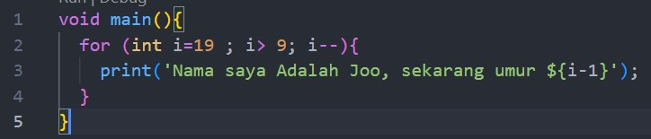
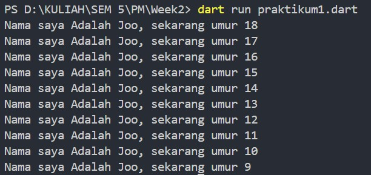

Tugas Praktikum Minggu 2

Soal 1  
Modifikasilah kode pada baris 3 di VS Code atau Editor Code favorit Anda berikut ini agar mendapatkan keluaran (output) sesuai yang diminta!  
Jawab :

Soal 2
Mengapa sangat penting untuk memahami bahasa pemrograman Dart sebelum kita menggunakan framework Flutter ? Jelaskan!
Jawab:
Memahami bahasa pemrograman Dart sangat penting sebelum menggunakan Flutter karena Flutter dibangun di atas Dart. Karena hal tersebut, pemahaman tentang Dart akan memudahkan dalam menulis logika aplikasi, mengelola state, dan memanfaatkan fitur Flutter dengan lebih efisien. Dart juga memungkinkan optimalisasi performa aplikasi karena Flutter menggunakan Dart VM untuk menjalankan kode secara langsung tanpa jembatan native seperti framework lain.

Soal 3
Rangkumlah materi dari codelab ini menjadi poin-poin penting yang dapat Anda gunakan untuk membantu proses pengembangan aplikasi mobile menggunakan framework Flutter.
Jawab:
Rangkuman Materi Dart dari Codelab
1.	Fitur Bahasa Dart:
o	Dart adalah bahasa modern dengan fitur seperti productive tooling (alat bantu produktif), garbage collection (pengelolaan memori), dan type annotations opsional. Dart mendukung statically typed dan type inference untuk keamanan tipe, serta portability untuk platform web, mobile, ARM, dan x86.
2.	Evolusi Dart:
o	Dart diluncurkan pada 2011, awalnya untuk pengembangan web sebagai alternatif JavaScript. Namun, fokusnya kini berpindah ke mobile development dengan Flutter, membawa performa tinggi dan alat bantu pengembangan yang stabil.
3.	Cara Kerja Dart:
o	Kode Dart dapat dijalankan melalui dua metode: Dart VM (dengan JIT untuk debugging cepat dan hot reload) atau kompilasi ke JavaScript/AOT (untuk kinerja tinggi). JIT memungkinkan pengembangan cepat, sedangkan AOT meningkatkan performa aplikasi produksi.
4.	Struktur Bahasa Dart:
o	Dart mendukung pemrograman object-oriented (OOP) dengan fitur encapsulation, inheritance, abstraction, dan polymorphism. Operator aritmatika, logika, serta perulangan mirip dengan bahasa pemrograman tingkat tinggi lainnya seperti C atau JavaScript.
5.	Hands-on with Dart
o	Untuk menjalankan kode Dart secara lokal, simpan kode ke dalam file dengan ekstensi .dart (misalnya, hello_world.dart), kemudian jalankan dengan perintah:
dart hello_world.dart
o	Kode "Hello World" ini memperkenalkan fitur dasar Dart seperti loop dan fungsi. Fungsi main berperan sebagai titik awal eksekusi aplikasi Dart. Setiap aplikasi Dart harus memiliki fungsi main.
o	Struktur Fungsi main
o	    Void: Menunjukkan fungsi tidak mengembalikan nilai.
o	    main: Nama fungsi utama yang digunakan oleh Dart VM.
o	    Tanda kurung ( ): Fungsi ini tidak menerima parameter.
o	    Kurung kurawal { }: Menandai batasan blok kode fungsi.
o	Function vs. Method
o	    Function: Fungsi yang berada di luar kelas.
o	    Method: Fungsi yang terikat pada kelas dan memiliki akses ke instance kelas melalui this.
Fungsi main adalah contoh function.

Soal 4
Buatlah slide yang berisi penjelasan dan contoh eksekusi kode tentang perbedaan Null Safety dan Late variabel ! (Khusus soal ini kelompok berupa link google slide)
Kumpulkan jawaban Anda di spreadsheet pada tautan yang telah disediakan di grup telegram. Untuk soal nomor 1 sampai 3 push repo GitHub Anda.
