**Praktikum 1: Menerapkan Control Flows ("if/else")**

Langkah 1:

Ketik atau salin kode program berikut ke dalam fungsi main():
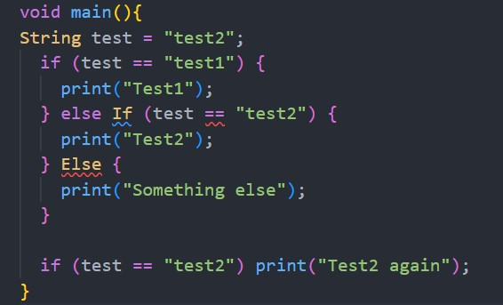

Langkah 2:

Silakan coba eksekusi (Run) kode pada langkah 1 tersebut. Apa yang terjadi? Jelaskan!

Jawab:
Hasilnya Error karena adanya typo pada else is dan else, penggunaan huruf besar kecil harus diperhatikan di dalam Dart karena hal tersebut termasuk case-sensitive.

Langkah 3:

Tambahkan kode program berikut, lalu coba eksekusi (Run) kode Anda.

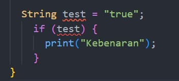

Jawab :
Hasilnya eror, karena ada dua kesalahan di kode tersebut yaitu
1. duplikat variabel test
2. Pada kondisi if mencoba akses ke variabel test yang bertipe String, sedangkan pernyataan if dalam Dart membutuhkan nilai boolean (true atau false). Jadi tidak bisa menggunakan String secara langsung sebagai kondisi

Perbaikan:
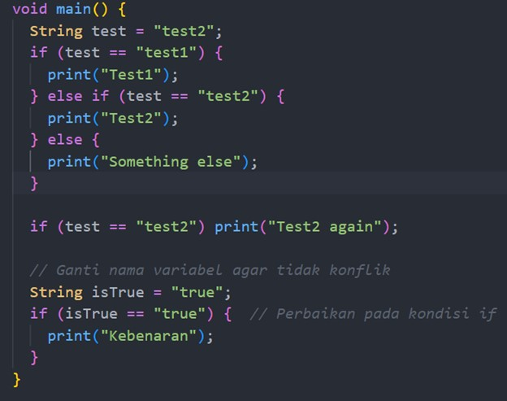

**Praktikum 2: Menerapkan Perulangan "while" dan "do-while"**

Langkah 1:

Ketik atau salin kode program berikut ke dalam fungsi main().

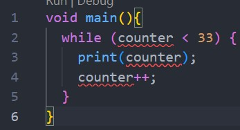

Langkah 2:

Silakan coba eksekusi (Run) kode pada langkah 1 tersebut. Apa yang terjadi? Jelaskan! Lalu perbaiki jika terjadi error.

Jawab: Hasilnya adalah Eror. Dalam kode tersebut variabel counter belum dibuat atau dideklarasikan terlebih dahulu.

Perbaikan :
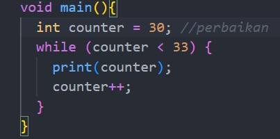

Hasil:
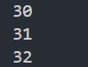

Langkah 3:

Tambahkan kode program berikut, lalu coba eksekusi (Run) kode Anda.
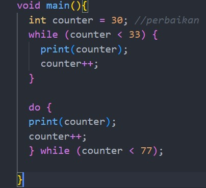

Jawab :
Tidak ada yang salah pada kode tersebut. Karena perbaikan variabel counter sudah ditangani di kode sebelumnya, jadi jika variabel counter dipanggil lagi untuk proses do-while tersebut maka tidak akan masalah. Hasil dari kode tersebut (khusus do-while saja) akan memprint angka 33-76

**Praktikum 3: Menerapkan Perulangan "for" dan "break-continue"**

Langkah 1:

Ketik atau salin kode program berikut ke dalam fungsi main().
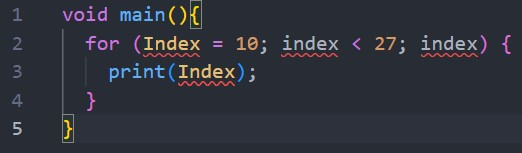

Langkah 2:

Silakan coba eksekusi (Run) kode pada langkah 1 tersebut. Apa yang terjadi? Jelaskan! Lalu perbaiki jika terjadi error.

Jawab:
Ada dua kemungkinan error pada kode tersebut:
1. Variabel index belum dideklarasikan
2. variabel index pada loop for harus memperhatikan huruf besar kecil(case-sensitive) antara variabel Index atau index. Dalam perbaikan saya akan menggunakan variabel (int index)
3. Tidak ada kondisi agar loop berhenti. jika kode tersebut dijalankan maka pemeriksaan variabel counter akan terus bernilai true karena counter nilainya akan selalu lebih kecil dari 27 dan hasilnya akan infinite loop.

Perbaikan:
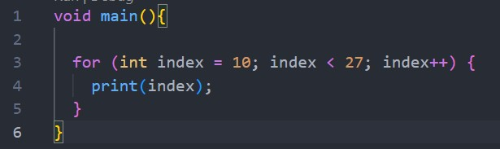

Hasil:
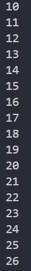

Langkah 3:

Tambahkan kode program berikut di dalam for-loop, lalu coba eksekusi (Run) kode Anda.

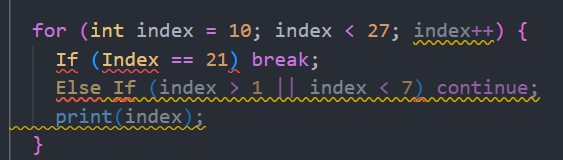

Hasilnya akan error.
karena variabel Index seharusnya ditulis dengan hururf kecil (index).
dan pada kode tersebut tidak akan menghasilkan output apa apa karena alur programnya seperti ini :

    for (int index = 10; index < 27; index++):

    Loop for dimulai dengan variabel index diinisialisasi ke nilai 10.
    Loop akan berjalan selama index kurang dari 27, dan setiap iterasi index bertambah 1 (index++).

    if (index == 21) break;:

    Jika index sama dengan 21, maka loop akan dihentikan dengan perintah break. Semua eksekusi setelah kondisi index == 21 tidak akan dijalankan.

    else if (index > 1 || index < 7) continue;:

    Jika index lebih besar dari 1 atau kurang dari 7, maka perintah continue akan dijalankan, yang berarti loop akan melanjutkan ke iterasi berikutnya tanpa menjalankan baris berikutnya (yaitu tanpa mencetak print(index)).
    Dalam kasus ini, karena kondisi index > 1 selalu true (karena index dimulai dari 10), perintah continue selalu dijalankan, dan kode print(index) tidak akan pernah dijalankan.

Perbaikan:
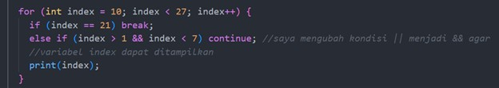

Hasil:
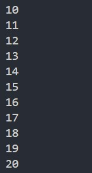

Tugas Praktikum

    Silakan selesaikan Praktikum 1 sampai 3, lalu dokumentasikan berupa screenshot hasil pekerjaan beserta penjelasannya!
    Buatlah sebuah program yang dapat menampilkan bilangan prima dari angka 0 sampai 201 menggunakan Dart. Ketika bilangan prima ditemukan, maka tampilkan nama lengkap dan NIM Anda.
    Kumpulkan berupa link commit repo GitHub pada tautan yang telah disediakan di grup Telegram!

Jawab :
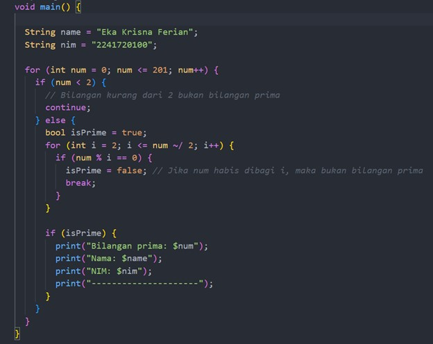

Hasil:
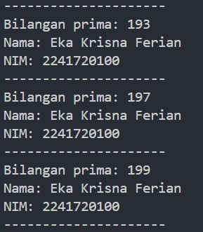

keterangan: dari angka 0-201 hasilnya akan menampilkan bilangan prima mulai dari 2 sampai 199.

