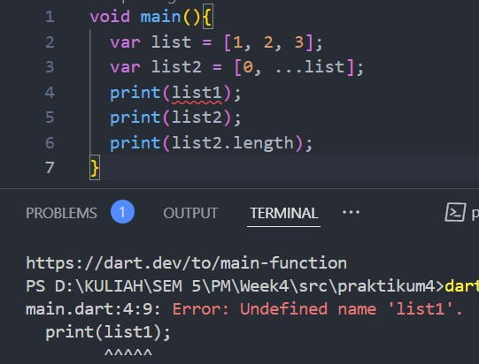
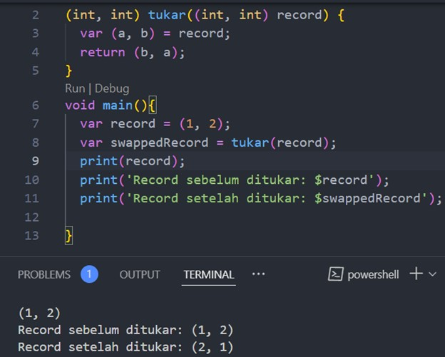

**#04 | Pengantar Bahasa Pemrograman Dart - Bagian 3**

**Praktikum 1: Eksperimen Tipe Data List**

Langkah 1:

Ketik atau salin kode program berikut ke dalam void main().

Langkah 2:

Silakan coba eksekusi (Run) kode pada langkah 1 tersebut. Apa yang terjadi? Jelaskan!

Jawab :
Output:

Penjelasan:
- var list = [1, 2, 3];:
Kamu mendeklarasikan sebuah variabel list yang berisi array (list) dengan tiga elemen: [1, 2, 3].

- assert(list.length == 3);:
Assert adalah cara untuk memverifikasi bahwa sebuah kondisi benar saat runtime (saat kode berjalan). Jika kondisi salah, program akan menimbulkan error.
Pada baris ini, kamu memverifikasi bahwa panjang list (list.length) sama dengan 3. Karena list berisi 3 elemen, kondisi ini benar dan tidak ada error yang dihasilkan.

- assert(list[1] == 2);:
Kamu memverifikasi bahwa elemen pada indeks ke-1 dari list adalah 2. Dalam Dart (dan kebanyakan bahasa pemrograman), indeks list dimulai dari 0, sehingga list[1] mengacu pada elemen kedua, yaitu 2. Karena ini benar, tidak ada error.

- print(list.length);
Mencetak panjang list, yaitu 3.

- print(list[1]);:
Mencetak elemen pada indeks ke-1 dari list, yaitu 2.

- list[1] = 1;:
Mengubah elemen pada indeks ke-1 dari list menjadi 1. Sebelumnya list[1] bernilai 2, tetapi sekarang diubah menjadi 1.

- assert(list[1] == 1);:
Memverifikasi bahwa elemen pada indeks ke-1 sekarang adalah 1. Karena elemen tersebut memang telah diubah menjadi 1, kondisi ini benar dan tidak ada error.

- print(list[1]);:
Mencetak elemen pada indeks ke-1, yang sekarang adalah 1.

Langkah 3:

Ubah kode pada langkah 1 menjadi variabel final yang mempunyai index = 5 dengan default value = null. Isilah nama dan NIM Anda pada elemen index ke-1 dan ke-2. Lalu print dan capture hasilnya.

Apa yang terjadi ? Jika terjadi error, silakan perbaiki.

Kode dan hasilnya :

Hasilnya tidak eror

**Praktikum 2: Eksperimen Tipe Data Set**

Langkah 1:

Ketik atau salin kode program berikut ke dalam fungsi main().

Langkah 2:

Silakan coba eksekusi (Run) kode pada langkah 1 tersebut. Apa yang terjadi? Jelaskan! Lalu perbaiki jika terjadi error.

Hasil:
Saat kode ini dijalankan, program akan menampilkan kumpulan elemen dari halogens berupa set, yaitu:

Langkah 3:

Tambahkan kode program berikut, lalu coba eksekusi (Run) kode Anda.

src dan output:

Perbaikan agar dapat menambahkan elemen dengan function .add() dan .addAll() untuk nama dan nim:

**Praktikum 3: Eksperimen Tipe Data Maps**

Langkah 1:

Ketik atau salin kode program berikut ke dalam fungsi main().

Langkah 2:

Silakan coba eksekusi (Run) kode pada langkah 1 tersebut. Apa yang terjadi? Jelaskan! Lalu perbaiki jika terjadi error.

Penjelasan:
- Program akan menampilkan kedua map, gifts dan nobleGases. Tidak ada error karena kode ini valid.
- gifts adalah map dengan kunci (key) berupa string dan nilai (value) berupa campuran antara string dan integer.
- nobleGases adalah map dengan kunci berupa integer dan nilai berupa campuran antara string dan integer.

Langkah 3:

Tambahkan kode program berikut, lalu coba eksekusi (Run) kode Anda.

Hasil :

Map gifts dan nobleGases diperbarui dengan nilai yang baru untuk beberapa elemen. dan Tidak akan ada error dalam kode ini, karena Dart mendukung pengubahan nilai dalam map serta penambahan elemen baru.

Tambahkan elemen nama dan NIM Anda pada tiap variabel di atas (gifts, nobleGases, mhs1, dan mhs2).

src dan hasil:

**Praktikum 4: Eksperimen Tipe Data List: Spread dan Control-flow Operators**

Langkah 1:

Ketik atau salin kode program berikut ke dalam fungsi main().

Langkah 2:

Silakan coba eksekusi (Run) kode pada langkah 1 tersebut. Apa yang terjadi? Jelaskan! Lalu perbaiki jika terjadi error.

Hasil langkah 1 dan 2 :

Penjelasan :
Hasilnya error karena variabel list1 tidak ada dalam kode, sehingga memunculkan pesan error Undefined name 'list1'.

Perbaikan:

Langkah 3:

Tambahkan kode program berikut, lalu coba eksekusi (Run) kode Anda.

hasil:

Penjelasan eror :
Error yang terjadi adalah karena tidak ada deklarasi variabel list1.

Perbaikan:

Tambahkan variabel list berisi NIM Anda menggunakan Spread Operators. 

Hasil:

Langkah 4:

Tambahkan kode program berikut, lalu coba eksekusi (Run) kode Anda.

Hasil:

Penjelasan : 
Eror terjadi karena Sebelum menggunakan promoActive dalam list, haeus dideklarasikan dan diberikan nilai. Misalnya, bool promoActive = true;. Jika tidak dideklarasikan, maka akan error.

Perbaikan :

Langkah 5:

Tambahkan kode program berikut, lalu coba eksekusi (Run) kode Anda.

Eror seperti langkah 4

Perbaikan:

Langkah 6:

Tambahkan kode program berikut, lalu coba eksekusi (Run) kode Anda.

Hasil:

Tidak ada error dalam kode ini karena semua elemen dan kondisi ditangani dengan benar.

Manfaat Collection For:
- Efisiensi: Dengan menggunakan Collection For, Anda dapat membuat list baru berdasarkan list yang sudah ada dengan lebih efisien dan ringkas.
- Fleksibilitas: Anda dapat menerapkan berbagai transformasi atau format pada elemen yang ada dalam list, seperti yang kita lakukan dengan #$i.
- Keterbacaan: Kode menjadi lebih mudah dibaca dan dipahami, karena semua elemen dihasilkan dalam satu baris tanpa memerlukan loop terpisah.

**Praktikum 5: Eksperimen Tipe Data Records**

Langkah 1:

Ketik atau salin kode program berikut ke dalam fungsi main().

Eror karena kode tidak dittup dengan ;

Perbaikan:

Langkah 3:

Tambahkan kode program berikut di luar scope void main(), lalu coba eksekusi (Run) kode Anda.

Penjelasan:
Fungsi tukar():

    Fungsi tukar mengambil sebuah tuple dengan dua integer sebagai parameter. fungsi ini menggunakan destructuring untuk mendapatkan nilai a dan b, kemudian mengembalikan tuple yang dibalik, yaitu (b, a).

Penggunaan dalam main():

    Di dalam main(), membuat tuple record yang berisi dua nilai integer (1 dan 2).
    Kemudian memanggil fungsi tukar(record) untuk menukar nilai-nilai dalam tuple dan menyimpan hasilnya di swappedRecord.
    Terakhir di print.

Langkah 4:

Tambahkan kode program berikut di dalam scope void main(), lalu coba eksekusi (Run) kode Anda.

Error karena variabel mahasiswa belum ada nilainya

Perbaikan:

Langkah 5:

Tambahkan kode program berikut di dalam scope void main(), lalu coba eksekusi (Run) kode Anda.

Hasil

Tidak ada eror

Gantilah salah satu isi record dengan nama dan NIM Anda:

**TUGAS PRAKTIKUM**

1.	Silakan selesaikan Praktikum 1 sampai 5, lalu dokumentasikan berupa screenshot hasil pekerjaan Anda beserta penjelasannya!
2.	Jelaskan yang dimaksud Functions dalam bahasa Dart!

**jawab :**
Fungsi dalam bahasa Dart adalah blok kode yang dapat dipanggil untuk menjalankan tugas tertentu. Fungsi memungkinkan pengorganisasian kode, meningkatkan keterbacaan, dan memungkinkan penggunaan kembali kode. Fungsi dapat menerima parameter dan mengembalikan nilai.

3.	Jelaskan jenis-jenis parameter di Functions beserta contoh sintaksnya!

**Jawab:**

Parameter Positional (Posisi):

    Parameter yang diharuskan dan urutannya penting.
    Contoh:

void tampilkanNama(String nama) {
  print(nama);
}

Parameter Named (Nama):

    Parameter yang disebutkan dengan nama, tidak terikat pada urutan.
    Contoh:

void tampilkanInfo({required String nama, int? umur}) {
  print('Nama: $nama, Umur: $umur');
}

Parameter Default:

    Parameter yang memiliki nilai default jika tidak diberikan.
    Contoh:

void tampilkanInfo(String nama, {int umur = 20}) {
  print('Nama: $nama, Umur: $umur');
}**
4.	Jelaskan maksud Functions sebagai first-class objects beserta contoh sintaknya!

**Jawab:**

Fungsi dalam Dart adalah first-class objects, yang berarti fungsi dapat disimpan dalam variabel, dilewatkan sebagai parameter, dan dikembalikan dari fungsi lain.

Contoh:

void cetak(String pesan) {
  print(pesan);
}

void fungsiKedua(void Function(String) func) {
  func('Hello from fungsiKedua!');
}

void main() {
  fungsiKedua(cetak);
}

5.	Apa itu Anonymous Functions? Jelaskan dan berikan contohnya!

**Jawab:**

Anonymous functions, atau fungsi tanpa nama, adalah fungsi yang tidak memiliki nama. Fungsi ini sering digunakan sebagai callback atau sebagai argumen untuk fungsi lain.

Contoh:

var list = [1, 2, 3];
list.forEach((item) {
  print(item);
});

6.	Jelaskan perbedaan Lexical scope dan Lexical closures! Berikan contohnya!

**Jawab:**
Perbedaan Lexical Scope dan Lexical Closures

    Lexical Scope: Merupakan aturan akses variabel di dalam fungsi. Variabel yang didefinisikan dalam fungsi hanya dapat diakses dalam fungsi tersebut.

    Contoh:

void fungsi() {
  var x = 10;
  print(x); // x hanya dapat diakses di sini
}

Lexical Closures: Adalah konsep di mana fungsi dapat mengingat lingkungan di mana ia didefinisikan, termasuk variabel di luar fungsinya. Ini memungkinkan fungsi untuk mengakses variabel meskipun fungsi tersebut dipanggil di luar konteks asalnya.

Contoh:

Function buatCounter() {
  var count = 0; // Variabel di luar
  return () {
    count++; // Fungsi ini mengingat variabel count
    return count;
  };
}

void main() {
  var counter = buatCounter();
  print(counter()); // 1
  print(counter()); // 2
}

7.	Jelaskan dengan contoh cara membuat return multiple value di Functions!

**Jawab:**
Dart bisa mengembalikan beberapa nilai dari fungsi dengan menggunakan tuple (Record) atau mengembalikan objek.
Contoh dengan Record:

(int, int) hitung(int a, int b) {
  return (a + b, a * b); // Mengembalikan dua nilai
}

void main() {
  var hasil = hitung(3, 4);
  print('Jumlah: ${hasil.$1}, Kali: ${hasil.$2}'); // Jumlah: 7, Kali: 12
}

Contoh dengan Objek:

class Hasil {
  int jumlah;
  int kali;

  Hasil(this.jumlah, this.kali);
}

Hasil hitung(int a, int b) {
  return Hasil(a + b, a * b); // Mengembalikan objek
}

void main() {
  var hasil = hitung(3, 4);
  print('Jumlah: ${hasil.jumlah}, Kali: ${hasil.kali}'); // Jumlah: 7, Kali: 12
}

8.	Kumpulkan berupa link commit repo GitHub pada tautan yang telah disediakan di grup Telegram!

